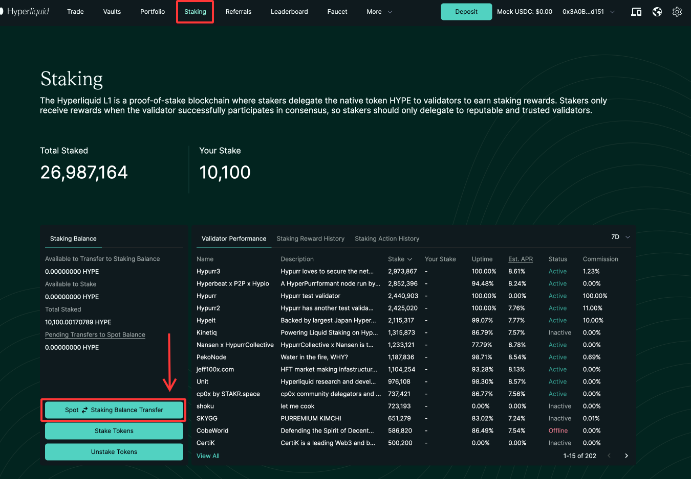
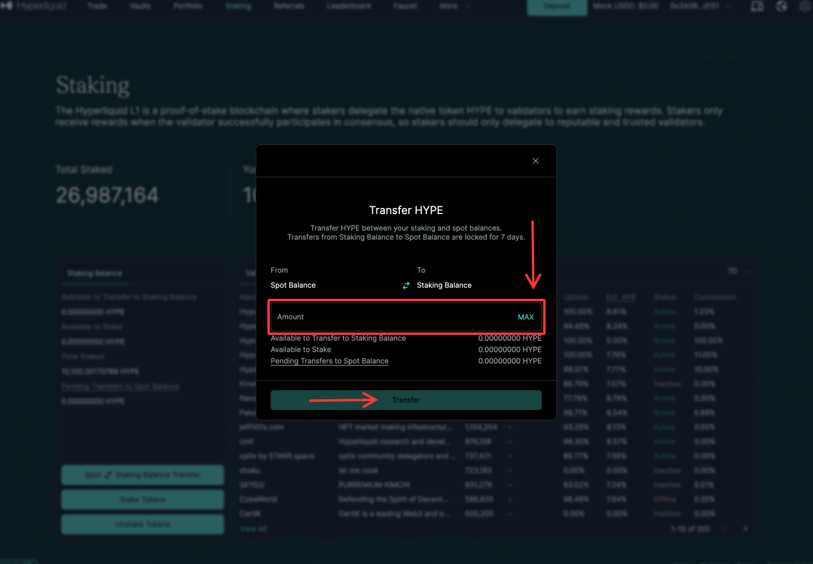
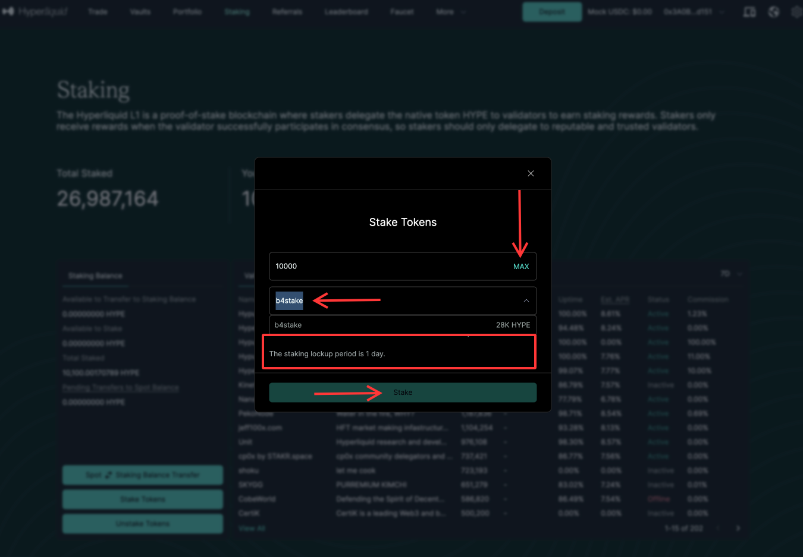

# Guide to Staking Test HYPE tokens on the b4stake Validator

This guide will help you stake your test HYPE tokens on the **b4stake** testnet validator.

---

## Step 1: Navigate to the Staking Section

Go to [https://app.hyperliquid-testnet.xyz/staking/](https://app.hyperliquid-testnet.xyz/staking/) and open the **Staking** section of the testnet portal.

---

## Step 2: Transfer Test HYPE to Staking Balance

- Click the **Spot - Staking Balance Transfer** button.
- In the dialog that opens, enter the amount of HYPE you want to stake.

- Click the **Transfer** button.

---

## Step 3: Stake HYPE Tokens

- Click the **Stake Tokens** button.

- In the dialog that opens:
  - Enter the amount of HYPE tokens in the first field.
  - Select the **b4stake** validator in the second field.

---

## Completion

Click the **Stake** button.

That's it! You've successfully contributed to supporting the testnet and its validators. :) Thank you!
